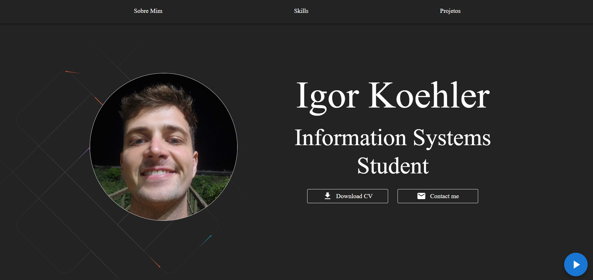

# 🌐 Meu Portfólio

Este é o repositório do meu portfólio pessoal, desenvolvido com **React + TypeScript + Vite**.  
O objetivo é apresentar meus projetos, habilidades e um pouco sobre minha trajetória como estudante de programação.  

## 🦾 Funcionalidades

- 📌 Seções principais:
  - **Home / Hero** → apresentação inicial  
  - **About** → informações sobre mim  
  - **Projects** → listagem de projetos com links para código e deploy  
  - **Footer** → redes sociais e contato  

- 🎵 **Music Player fixo** no canto inferior direito da tela (play/pause em loop)  
- 📱 **Responsivo**, adaptado para desktop e mobile  
- 🎨 Estilização com **Material UI (MUI)**  

---

## 🚀 Tecnologias Utilizadas

- [React](https://reactjs.org/) + [Vite](https://vitejs.dev/)  
- [TypeScript](https://www.typescriptlang.org/)  
- [Material UI](https://mui.com/)  
- [Framer Motion](https://www.framer.com/motion/) (animações)  
- [Styled Components do MUI](https://mui.com/system/styled/)  

---

## 📂 Estrutura do Projeto

```
📦 src
 ┣ 📂 components       → componentes reutilizáveis (Navbar, Footer, MusicPlayer, etc.)
 ┣ 📂 Pages
 ┃ ┗ 📂 Home
 ┃    ┗ 📂 sections    → seções (HeroSection, AboutSection, ProjectsSection)
 ┣ 📂 assets           → imagens e ícones
 ┣ App.tsx             → estrutura principal
 ┗ main.tsx            → ponto de entrada
📦 public
 ┗ music.mp3           → música do player
```

---

## 🛠️ Como Rodar Localmente

1. Clone o repositório:
   ```bash
   git clone https://github.com/IgorKoehler15/myPortfolio.git
   ```
2. Entre na pasta do projeto:
   ```bash
   cd myPortofolio
   ```
3. Instale as dependências:
   ```bash
   npm install
   ```
4. Rode em ambiente de desenvolvimento:
   ```bash
   npm run dev
   ```
5. Acesse no navegador:
   ```
   http://localhost:5173
   ```

---

## 🌍 Deploy

Link do portfólio hospedado:  
- [Vercel](https://vercel.com/)   

---

## 📸 Prévia Portólio


---

## 📬 Contato

Se quiser trocar uma ideia, me chama:  

- 💼 [LinkedIn](https://www.linkedin.com/in/igor-henrique-koehler-88b1a4266/)  
- 📧 Email: igorkoehler15@gmail.com  
- 🖥️ [Meu Portfólio Online](https://seu-deploy.com)  

---

⚡ Feito com dedicação para mostrar minha jornada como desenvolvedor!  
